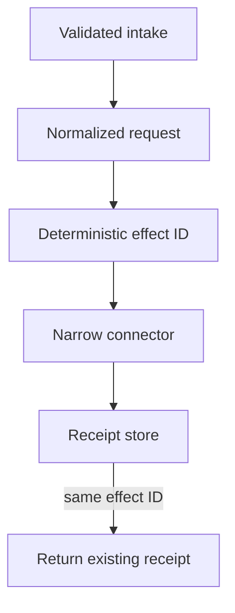

# Workflow Integration Reference

A small, independent reference implementation for a dependable integration pattern: validate intake, construct a deterministic effect identity, invoke a narrow connector, and retain a receipt that prevents accidental duplicate work.

It is a portfolio demonstration by [Jonathan R. Santana](https://github.com/SustainShujaa). All connectors are simulated; the repository contains no external endpoints, credentials, customer records, or private workflow logic.

## What it demonstrates



The workflow accepts a small intake record, validates it, selects only a known connector, and uses an effect ID derived from the workflow and normalized payload. A repeat request returns the original receipt instead of invoking the connector again.

## Run it

Requires Node.js 20 or later.

```bash
npm test
npm run demo
```

## Design boundaries

- An integration connector is not a general-purpose authority channel.
- The example returns simulated effects only; it does not send messages, update CRM records, or call any API.
- Idempotency reduces accidental duplicate effects; it does not establish business correctness or authorization.
- A receipt records what this workflow attempted and returned; it does not prove an external system’s final state.

See [architecture notes](docs/architecture.md) and [the disclosure ledger](docs/disclosure-ledger.md) for scope and publication controls.
